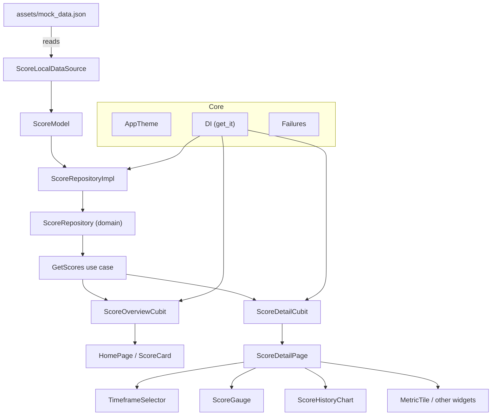

# Rolla Scores App

Flutter demo that recreates the Rolla score detail preview experience with clean, feature-first architecture and local JSON data.

## Architecture
- **Flow:** `assets/mock_data.json` (data) → models/repository (`data`) → entities/use cases (`domain`) → cubits/widgets (`presentation`).
- **Feature-first + Clean Architecture:** `lib/features/scores/{data,domain,presentation}` with `core/` for shared theme/DI/error types.
- **State:** `flutter_bloc` cubits (`ScoreOverviewCubit`, `ScoreDetailCubit`) emit loading/error/loaded states and keep UI free of business logic.
- **DI:** `get_it` wiring in `lib/core/di/injection.dart` and `lib/features/scores/di/scores_injection.dart`.
- **UI components:** custom `TimeframeSelector` (tab bar), `ScoreGauge` (radial gauge), and `ScoreHistoryChart` (bar chart with missing-data handling); shared tiles/cards for reuse.

### Diagram (mermaid)


## Setup & Run
```bash
flutter pub get
flutter run
```
- Flutter 3.x recommended; no additional build steps required (data is local JSON).
- Use `flutter analyze` and `flutter test` as needed.

## Assumptions & Notes
- Data comes entirely from `assets/mock_data.json`; null history values are rendered as visible placeholders instead of being dropped.
- Timeframes (1D/7D/30D/1Y) drive gauge vs. chart selection; pull-to-refresh re-reads local data.
- Insights are single strings per timeframe.
- Metric coloring uses `AppTheme.getMetricColor`; icons map via `MetricIconMapper`.
